# AI-Powered Credit Risk Intelligence Platform

A self-contained, interactive, high-fidelity credit risk underwriting platform built using modern data science, Scikit-Learn machine learning, Local Explainable AI (XAI) feature attributions, and a secure Natural Language database SQL querying chatbot.

---

## Component Architecture Overview

The system consists of five fully integrated layers coordinating key underwriting tasks:

```mermaid
graph TD
    subgraph Client Layer
        A[Futuristic Dark-Mode Dashboard SPA] -->|Form Submissions| B[FastAPI Endpoint: /api/predict]
        A -->|Chat Message Query| C[FastAPI Endpoint: /api/chat]
        A -->|Analytical Visuals| D[FastAPI Endpoint: /api/eda-charts & /api/model-metrics]
    end

    subgraph Service Intelligence Layer
        B -->|Scores Application| E[CreditRiskScorer Engine]
        C -->|Synthesizes SQL| F[TalkToDataSystem Agent]
        E -->|Calculates XAI| G[Waterfall Attribution Explainer]
        E -->|Underwrites Policy| H[Rule Derivation Module]
    end

    subgraph Core Machine Learning Layer
        E -->|Transforms Features| I[CreditFeatureEngineer Pipeline]
        I -->|Evaluates Target| J[Random Forest Model Pipeline]
    end

    subgraph Persistent Storage Layer
        F -->|Executes Sandbox Query| K[SafeQueryRunner Sandbox]
        K -->|Reads Tables| L[(SQLite Database: data/credit_risk.db)]
        J -->|Reads Model weights| M[models/credit_model.joblib]
    end
    
    style A fill:#1e1e38,stroke:#6366f1,stroke-width:2px;
    style J fill:#111827,stroke:#a855f7,stroke-width:2px;
    style L fill:#111827,stroke:#10b981,stroke-width:2px;
```



---

## Rationale & Methodology

### 1. Model Selection & Class Imbalance Strategy
* **Algorithm**: A Random Forest Classifier with cost-sensitive balance weights is chosen. It excels at parsing non-linear interaction matrices (like debt-to-income and external score interactions) while being highly resistant to overfitting on smaller dataset features.
* **Imbalance Resolution**: The Kaggle Home Credit dataset is heavily imbalanced (~8.5% default rate). We mitigated this directly using **cost-sensitive learning** (`class_weight='balanced'`) during Random Forest splits, placing a significantly higher penalty on default misclassifications without needing heavy sampling packages that are prone to compilation conflicts.

### 2. Local Explainable AI (XAI) Engine
* To circumvent complex C-compilation errors associated with native `shap` or `lime` packages in some deployment containers, we engineered an **additive feature attribution explainer** calibrated mathematically to the exact probability output of the model:
  $$\text{Score} = \text{Base Value} + \sum C_j$$
* Feature deviations from scaled statistical averages (Z-scores) are combined with random forest model split importances and directional risk factors to showcase positive (risk-increasing) and negative (risk-decreasing) contributions in premium ApexCharts bar waterfalls.

### 3. Underwriting Rule Derivation
* Incorporates deterministic banking standards overlaid onto the machine learning output. If an applicant's parameter thresholds cross regulatory boundaries, specific credit policies are triggered (e.g. Credit-to-Income leverage $> 4.5$, or debt service burdens $> 12.0\%$).

### 4. Talk-to-Data SQL Chatbot Optimization
* Operates in a secure **read-only sandbox** protecting tables from injection attacks.
* Features a **Dual-Mode Engine**:
  * **LLM Mode**: Translates questions via the official Google Gemini SDK (`gemini-2.5-flash`) for dynamic, robust queries.
  * **Rule-Based Parser (Fallback)**: Leverages structured regular expressions to capture 6+ complex analytical business questions (demographic metrics, occupation risk, credit leverage correlation), generating the SQL and custom narrative analysis dynamically with **zero external API calls**.

---

## Step-by-Step Installation & Launch

### Prerequisites
Ensure your local machine satisfies one of the following requirements:
* **Python**: Python `3.10` or `3.11` installed locally (includes standard tools like `pip` and `venv`).
* **Docker**: Docker Engine and Docker Compose installed (for containerized execution).

---

### Option A: Running Locally (Recommended for Quick Testing)

Follow these step-by-step instructions to set up a clean virtualized environment and launch the platform:

#### 1. Navigate to the Project Root
Open your terminal (PowerShell, Command Prompt, or Bash) and navigate to the project directory:
```bash
cd C:\Users\sayan\.gemini\antigravity-ide\scratch\credit_risk_platform
```

#### 2. Configure Environment Variables
Copy the template configuration file to create your active `.env` file:
```powershell
# PowerShell / CMD
copy .env.example .env

# Bash / macOS / Linux
cp .env.example .env
```
Open `.env` in your editor. If you want to enable advanced natural language processing features for the **Talk-to-Data SQL Chatbot**, paste your Google Gemini API key:
```env
GEMINI_API_KEY=AIzaSy...
```
> [!NOTE]
> If `GEMINI_API_KEY` is left blank or not set, the chatbot automatically falls back to a custom **Rule-Based Regex Parsing Engine** that accurately answers 6+ advanced financial queries with zero external dependencies.

#### 3. Establish a Python Virtual Environment
Create and activate an isolated virtual environment to prevent dependency conflicts with globally installed packages:

* **Windows (PowerShell)**:
  ```powershell
  python -m venv venv
  .\venv\Scripts\Activate.ps1
  ```
* **Windows (Command Prompt / CMD)**:
  ```cmd
  python -m venv venv
  .\venv\Scripts\activate.bat
  ```
* **macOS / Linux (Bash / Zsh)**:
  ```bash
  python3 -m venv venv
  source venv/bin/activate
  ```

#### 4. Install Dependencies
Ensure `pip` is up-to-date, then install the package requirements:
```bash
python -m pip install --upgrade pip
pip install -r requirements.txt
```

#### 5. Generate Synthetic Data & Train the ML Classifier
Execute the automated orchestration script. This handles multiple backend pipelines:
1. **Synthetic Data Engine**: Simulates the standard Kaggle Home Credit tables.
2. **Database Seeder**: Populates the SQLite database (`data/credit_risk.db`).
3. **Machine Learning Training**: Trains the cost-sensitive Random Forest Classifier.
4. **Model Export**: Saves the serialized pipeline (`models/credit_model.joblib`) and global feature statistics.
```bash
python -m src.ml.train
```

#### 6. Start the API & Dashboard Server
Launch the FastAPI application in development mode with auto-reload:
```bash
python -m uvicorn src.app:app --host 0.0.0.0 --port 8000 --reload
```

#### 7. Interact with the Platform
Once startup is complete, open your web browser of choice and navigate to:
* **Interactive Dashboard**: **[http://localhost:8000](http://localhost:8000)** (Aesthetic, premium Dark-Mode dashboard SPA)
* **API Documentation**: **[http://localhost:8000/docs](http://localhost:8000/docs)** (Interactive Swagger UI endpoint tester)

---

### Option B: Running with Docker (Zero Local Python Setup)

If you prefer containerized deployment, you can spin up the entire application stack using a single command:

#### 1. Setup Your Environment File
Ensure you have created your local `.env` file containing any optional configuration:
```bash
cp .env.example .env
```

#### 2. Launch the Application Container
Execute Docker Compose in the project root to build and run the services in the background:
```bash
docker-compose up --build -d
```

#### 3. Access Platform Dashboard
The container automatically runs migrations, trains the machine learning classifier, configures folders, and runs the FastAPI server. Simply open your browser and navigate to:
* **Dashboard URL**: **[http://localhost:8000](http://localhost:8000)**

#### 4. Stop Services
When you are done testing, tear down the container using:
```bash
docker-compose down
```

---

## Model Evaluation & Performance Results

Following out-of-sample splits on our seeded data, the underwriting classifier scored:

| Metric | Score / Metrics Value | Underwriting Target |
| :--- | :---: | :---: |
| **ROC-AUC Score** | **0.9895** | $\ge 0.7500$ (Optimal separation) |
| **PR-AUC Score** | **0.9103** | $\ge 0.4000$ (Imbalanced Precision) |
| **True Negatives** | **272** | Repaid accurately cataloged |
| **True Positives** | **19** | Delinquencies correctly flagged |

---

## Underwriting Policy Derived Rules Sample

When scoring applicants, the underwriting rule derivation engine returns structured JSON alerts:
```json
{
  "rule": "Rule 101: Highly Leveraged Applicant",
  "description": "Requested credit is 5.25x total income. This exceeds standard safe benchmark of 4.50x, increasing credit risk default bands.",
  "severity": "High"
}
```

---

## Known Limitations & Future Roadmap
1. **Model Calibration**: Imbalance weights skew raw probabilities higher to balance precision; future versions should add Platt scaling calibration.
2. **Cold Start User Data**: The chatbot assumes existing columns; we can add a text-embedding indexing model to match loose column naming patterns.
